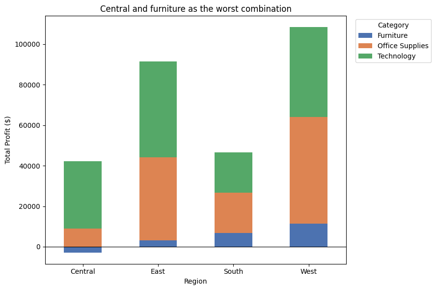
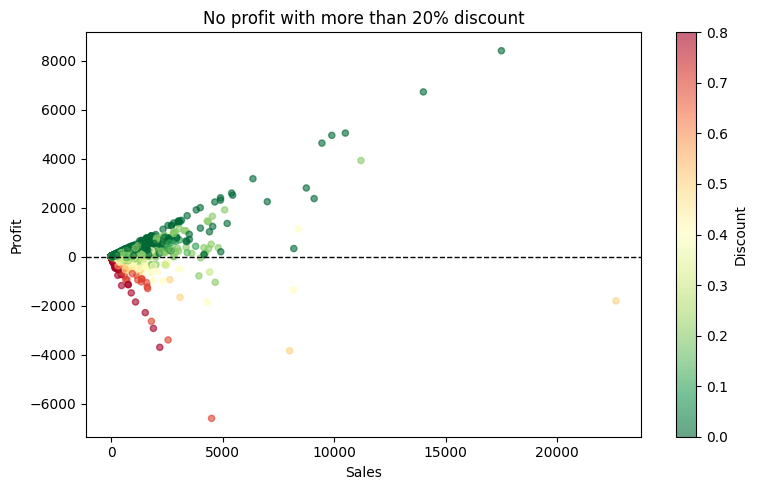
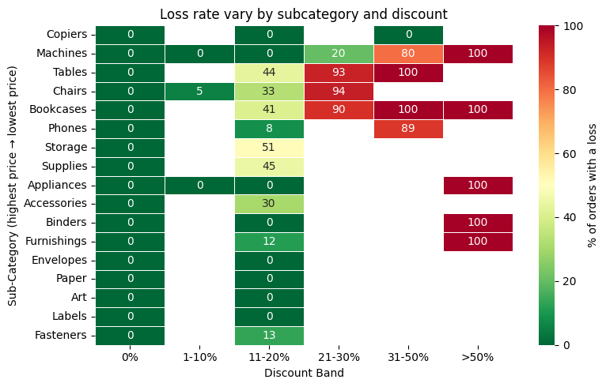
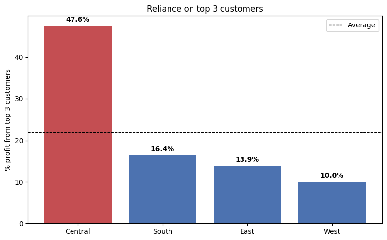
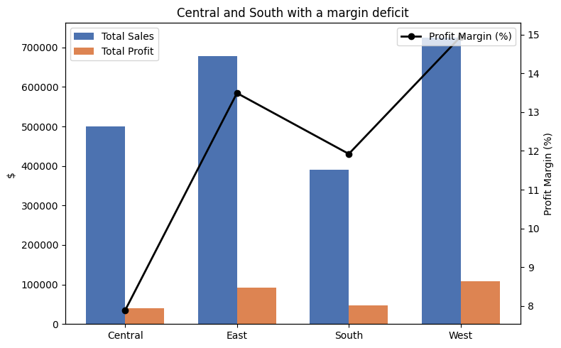
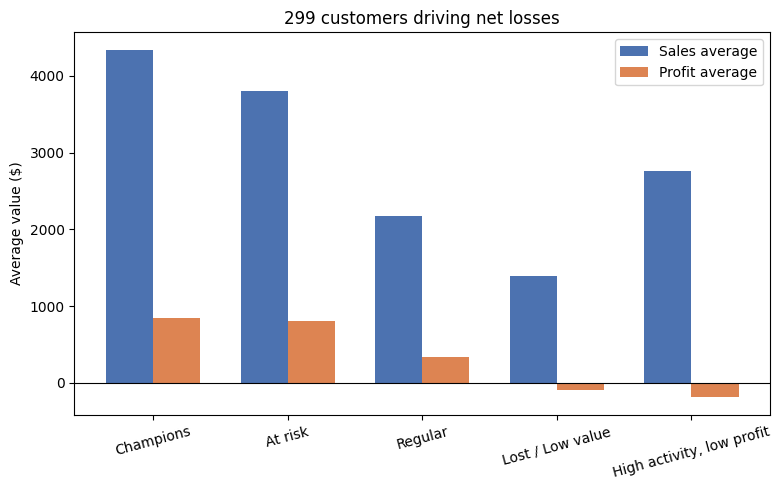

# Superstore Sales Analysis

This project analyzes roughly 10,000 order-level transactions from a US retail superstore, using a Kaggle dataset as the basis for a broader question: not just what sold, but where the business is actually making or losing money once discounts, shipping costs and customer behavior are factored in.
I approached it the way I'd approach a real internal request: starting from data cleaning,data quality, then working through discounting, seasonality, regional performance and customer value until each pattern could be tied to a specific, actionable recommendation. The goal wasn't to produce charts, but to produce findings someone could actually act on.


Notebook: [`notebook/Superstore_Sample_Analysis.ipynb`](./notebook/Superstore_Sample_Analysis.ipynb)
Report: [`report/Executive_Report.pdf`](./report/Executive_Report.pdf)


## Overview

The dataset covers order-level sales, discounts, profit, shipping and customer data from a retail company between 2014 and 2017, across three product categories (Furniture, Office Supplies, Technology) and four regions (Central, East, South, West).

The analysis is structured around different business sections:

**A. Discounting and profitability** 
How much discount can the business afford before it erodes margin? Does that threshold depend on product price? Which subcategories can safely sustain deep discounts?
**B. Time trends** 
Is the business growing in a healthy and stable way? Is there a recurring seasonal pattern? Is there a decline driven by a category, discounting or customer churn?
Does the trend vary by region?
**C. Regional performance** 
Which regions are the most profitable and the most at risk? Does any region show a structural or recurring loss in a specific category? Are there operational factors that compound a region's financial risk?
**D. Customer value**
Where does profitability really come from? Are there customers who generate large sales volumes but negative profit? Does a recency/frequency/monetary (RFM) segmentation reveal customer segments?
**E. Order-level economics**. How should individual order profitability be read? How should profit margin be interpreted alongside absolute profit at the order level?
Do small orders systematically look worse in margin terms than large ones? Which products or orders are the best candidates for a pricing or discount review?


## Key business insights

**1. The business is growing, but not evenly.** Total profit rose from $49.5K (2014) to $93.3K (2017), a +89% increase led by technology. Furniture is the exception: it is the least stable category and its profit fell 56.6% in 2017, mainly because of bookcases.

**2. The 2017 profit decline was localized not a company-wide downturn.**  Profit fell in Central (−63%) and South (−50%) regions, while East (+65%) and West (+82%) kept growing. There is no evidence of a general downturn.

<p align="center"></p>

**3. Discounting has a hard threshold at 20%.** Average margin swings from +26.7% on orders discounted ≤20% to −91.5% above 30%. The effect is a sudden break, not a gradual decline, which a simple correlation would miss.

<p align="center"></p>

**4. The safe discount level depends on price tier.** High-priced subcategories (machines, bookcases, tables) become loss making above 10–11% discount, while low-priced items tolerate 20–30%. A single company-wide discount cap is therefore the wrong tool.

<p align="center"></p>

**5. Central is the most structurally fragile region.** Its top three customers account for 47.6% of regional profit despite being just 0.5% of its customer base. Besides, average shipping times run roughly double those of other regions.

<p align="center"></p>

**6. West region is the company's top performer**: highest sales, highest profit, lowest average discount and a profit margin roughly double Central's. A natural benchmark for what "healthy" regional performance looks like elsewhere.

<p align="center"></p>

**7. Pareto profitability** The top 20% of customers generate 80% of total profit leading to a risk of reliance. 

**8. Some very active customers destroy value** A segment of 137 customers (17% of the customer base) with high activity and low profit buys almost as often as top customers while averaging a $189 loss each.

<p align="center"></p>

**9. An extreme margin means different things depending on order size** On tiny orders, a high margin is a ratio artefact caused by a few dollars of loss. On mid-sized orders, the same margin reflects real losses caused by deep discounts.


## Methodology

- **Data quality and cleaning**
• Removed 2 exact duplicates
• Investigated suspicious rows (same order + product): kept as legitimate separate lines since quantity, sales and profit differ
• 5 rows with missing financials, all from a single product with no other records. Dropped rather than imputed to avoid fabricating financial figures
• Outliers detected with the IQR rule and kept deliberately: large sales, profit and discount values are real high-value orders understood as a finding
• Logical validations: non-positive sales, quantities, discount range and postal code that should belong to a specific city/state

- **Feature engineering**
• Move the object to its correspondent object type (datetime features)
• Build extra data crossing existing variables (shipping time variable)
• Obtain data from existing data (date parts (year, month, quarter, weekday))
• Create line-level and order-level profit margin
• Set discount bands derived from quantile-based binning

- **Analysis**
• Discount behaviour across products and categories
• Time series by category, sub-category, region and segment
• Regional profiling: sales, profit, margin, discount, customer concentration, shipping time
• Customer analytics: Pareto (80/20) and RFM segmentation
• Price-tier analysis: loss rate by sub-category per discount band


## Why superstore sample analysis? 
Working with a well-known dataset challenges in the way of guiding the analysis to differ from other results.
It shows how I approach a real business problem: starting from the questions a manager would ask, questioning my own results and ending with decisions the business could actually take.

The structure represents a full analytical pipeline:
It opens with five business questions and every section answers one of them. Nothing is analysed "just because the column exists".
Before any analysis, each data-quality decision (duplicates, missing values, outliers) is documented with its reasoning, so every later number can be trusted.
The analysis follows a logical path: what is happening, where it happens, why it happens and who drives it, instead of a disconnected list of charts.
Chart reflect the storytelling ("Central and furniture as the worst combination") rather than being descriptive and all findings are consolidated in an executive summary with recommendations.

The result is a project where every insight is either statistically tested or checked against an alternative explanation before it becomes a recommendation.


## Repository structure

```
├── notebook/           # full analysis notebook
├── report/             # executive summary for a non technical audience
├── images/             # key charts
├── data/               # source dataset
├── requirements.txt    # Python dependencies
└── README.md
```


## Running the analysis

```
git clone https://github.com/<nuria>/Superstore-analysis.git
cd superstore-analysis
pip install -r requirements.txt
jupyter notebook Superstore_Sample_Analysis.ipynb

```


## Data source

[Superstore Sample dataset, Kaggle](https://www.kaggle.com/datasets/vivek468/superstore-dataset-final).


## Limitations 

Knowing what an analysis *cannot* say is as important as what it can. These are the main constraints of this project and how each could be addressed.
1. **Profit is a black box (data).** The dataset reports profit, but not its components: product cost, freight or overheads. This means the analysis can locate *where* money is lost (e.g. Bookcases in Central) but not *why*. 
2. **Returns are invisible in the numbers (data).** The dataset records every sale at the moment of the order but contains no information on returns or refunds. Any returned order is therefore still counted as revenue and profit, which means sales and profit are likely overstated, and not evenly: if returns concentrate in certain products, regions or customers, some areas look healthier than they really are. This could affect key results, such as which customers qualify as "Champions" or how profitable each category is. 
3. **Correlation is not causation (approach).** The discount threshold is statistically robust but the data is observational: discounts may be applied precisely to products that were already hard to sell, which would make them look more harmful than they are. Only a controlled experiment, such as an A/B test of discount caps, could confirm the causal impact of the proposed tiered policy.
4. **Segmentation depends on design choices (methodology).** RFM segments are built from quartile cut-offs and rule-based definitions, so different but equally reasonable thresholds would move customers between segments. Customers are also identified by name rather than ID, which could merge different people with the same name. The segment sizes should therefore be read as estimates and their stability tested with alternative thresholds or a clustering method such as k-means.
5. **Some findings rest on small groups (scope).** The dataset covers a single US retailer over four years and several key results depend on few observations: Central's customer concentration is driven by just 3 customers, and some category/discount combinations have little or no data (e.g. Office Supplies in the 21–50% bands). These findings flag risks worth monitoring rather than general rules that would hold in another business or period.


## Author

Nuria Benítez Peñarando
https://www.linkedin.com/in/nuria-ben%C3%ADtez-pe%C3%B1arando-509429297/?isSelfProfile=true
